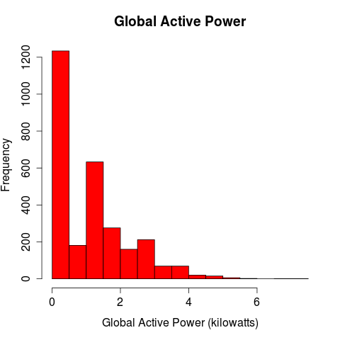
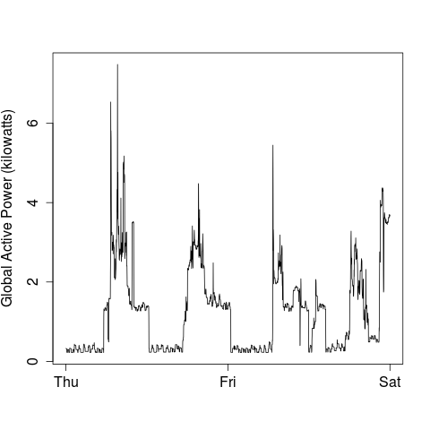
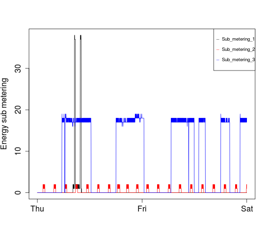
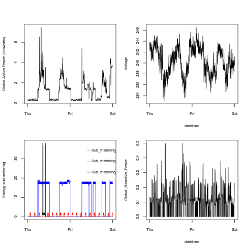

#Course Project 1

Graphs generated by code in this repo can be seen below.
They are saved in folder "figure"

Please note that R package "data.tabe" must be installed in order to run the code (function fread() used to speed up data upload)

### Plot 1

 

### Plot 2

 

### Plot 3

 

### Plot 4

 

